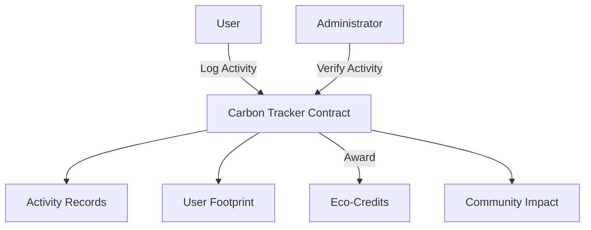

# Carbon Footprint Tracker

A blockchain-based application for tracking, verifying, and incentivizing personal carbon footprint reduction using Clarity smart contracts on the Stacks blockchain.

## Overview

The Carbon Footprint Tracker enables users to:
- Log and track various carbon-impacting activities
- Earn eco-credits for verified carbon-reducing actions
- Maintain transparent, immutable records of environmental contributions
- Participate in a community-driven environmental impact system

The platform categorizes activities into five main types:
- Transportation
- Energy consumption
- Food choices
- Waste management
- Carbon offsets

## Architecture

The system is built around a central smart contract that manages user activities, verification, and rewards.



### Key Components
- Activity tracking system
- User carbon footprint management
- Administrative verification system
- Eco-credit reward mechanism
- Community impact monitoring

## Contract Documentation

### carbon-tracker.clar

The main contract handling all carbon footprint tracking functionality.

#### Data Storage
- `user-carbon-footprint`: Maps users to their emission totals and eco-credits
- `activities`: Stores detailed records of all logged activities
- `administrators`: Maintains list of authorized verifiers
- `eco-credit-rates`: Defines reward rates for different activity types

#### Access Control
- Regular users can log activities
- Administrators can verify activities and manage eco-credit rates
- Contract owner can manage administrators

## Getting Started

### Prerequisites
- Clarinet
- Stacks wallet for deployment and interaction

### Installation

1. Clone the repository
2. Install dependencies:
```bash
clarinet install
```

3. Initialize the contract:
```clarity
(contract-call? .carbon-tracker initialize-contract)
```

## Function Reference

### Public Functions

**Log Activity**
```clarity
(define-public (log-activity (activity-type uint) (emissions int) (details (string-ascii 256)))
```
Example:
```clarity
(contract-call? .carbon-tracker log-activity u1 i-500 "Bicycle commute instead of driving")
```

**Verify Activity**
```clarity
(define-public (verify-activity (activity-id uint))
```
Example:
```clarity
(contract-call? .carbon-tracker verify-activity u1)
```

### Read-Only Functions

**Get User Footprint**
```clarity
(define-read-only (get-user-footprint (user principal))
```
Example:
```clarity
(contract-call? .carbon-tracker get-user-footprint tx-sender)
```

**Get Community Impact**
```clarity
(define-read-only (get-community-impact))
```

## Development

### Testing

Run the test suite:
```bash
clarinet test
```

### Local Development

1. Start a local Clarinet console:
```bash
clarinet console
```

2. Deploy the contract:
```clarity
(contract-call? .carbon-tracker initialize-contract)
```

## Security Considerations

### Limitations
- Activity verification relies on trusted administrators
- Carbon impact calculations are simplified estimates
- Eco-credit rates should be carefully calibrated

### Best Practices
- Always verify contract state before transactions
- Maintain secure administrator key management
- Regular verification of eco-credit distribution
- Monitor for unusual activity patterns

### Error Handling
The contract includes comprehensive error codes:
- `ERR-NOT-AUTHORIZED` (u100)
- `ERR-ACTIVITY-NOT-FOUND` (u101)
- `ERR-INVALID-PARAMETERS` (u102)
- `ERR-ACTIVITY-ALREADY-VERIFIED` (u103)
- `ERR-VERIFICATION-FAILED` (u104)
- `ERR-ACTIVITY-NOT-ELIGIBLE` (u105)